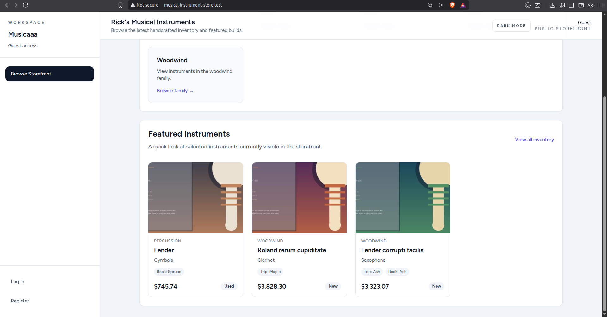
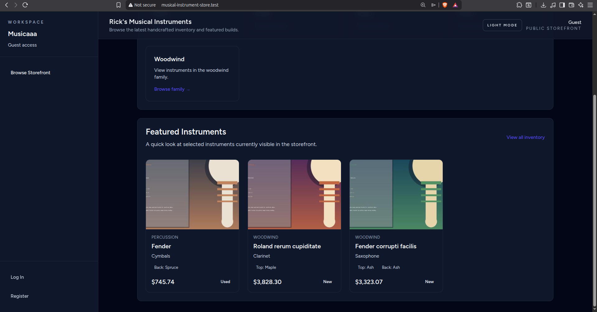
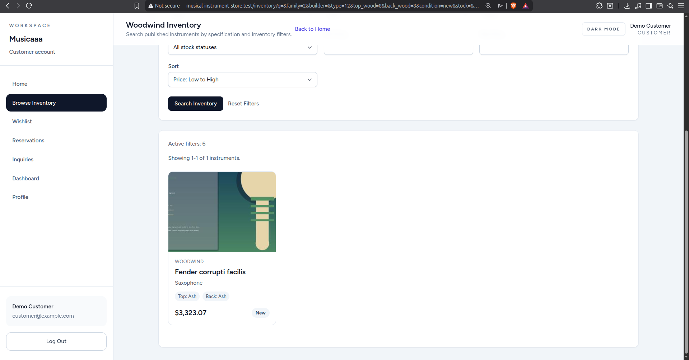
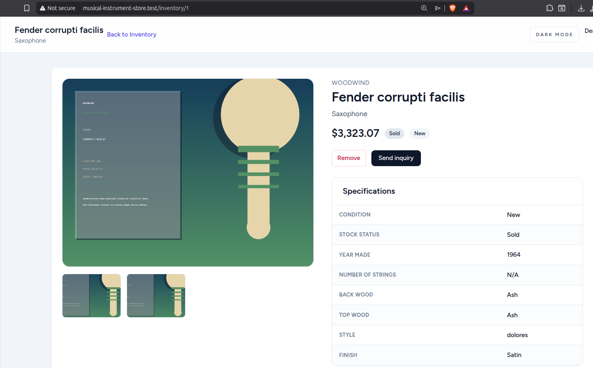
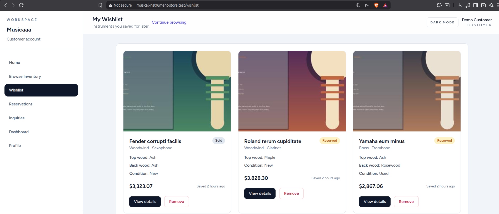
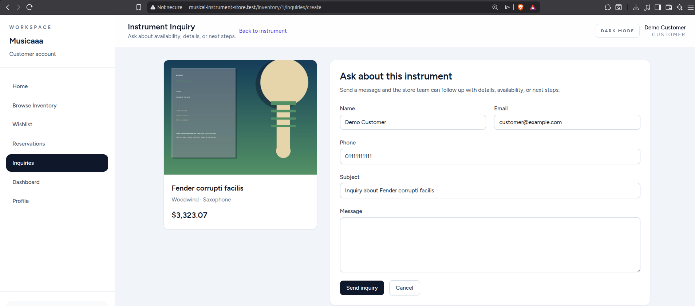
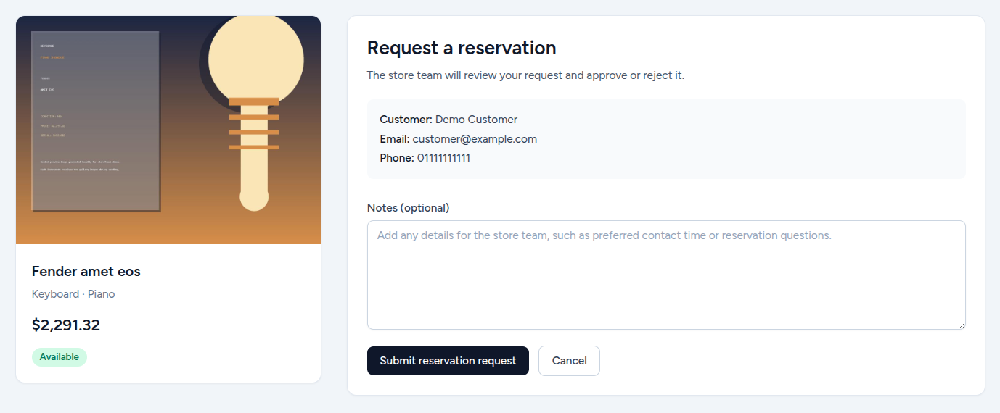
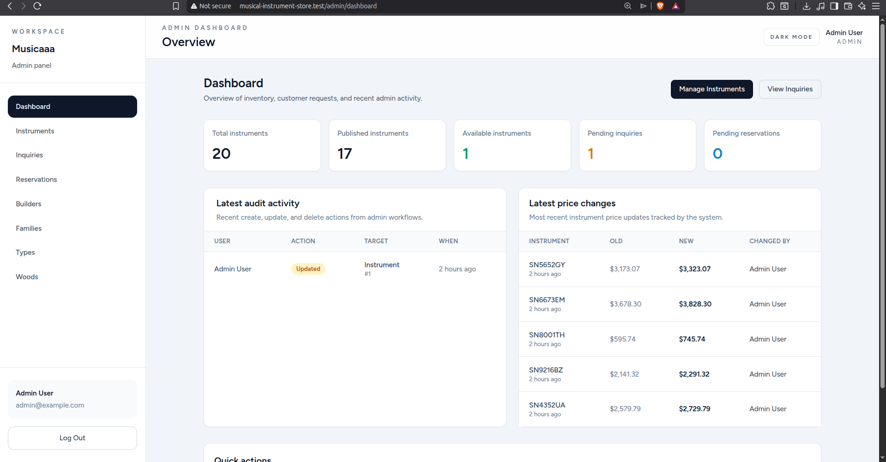
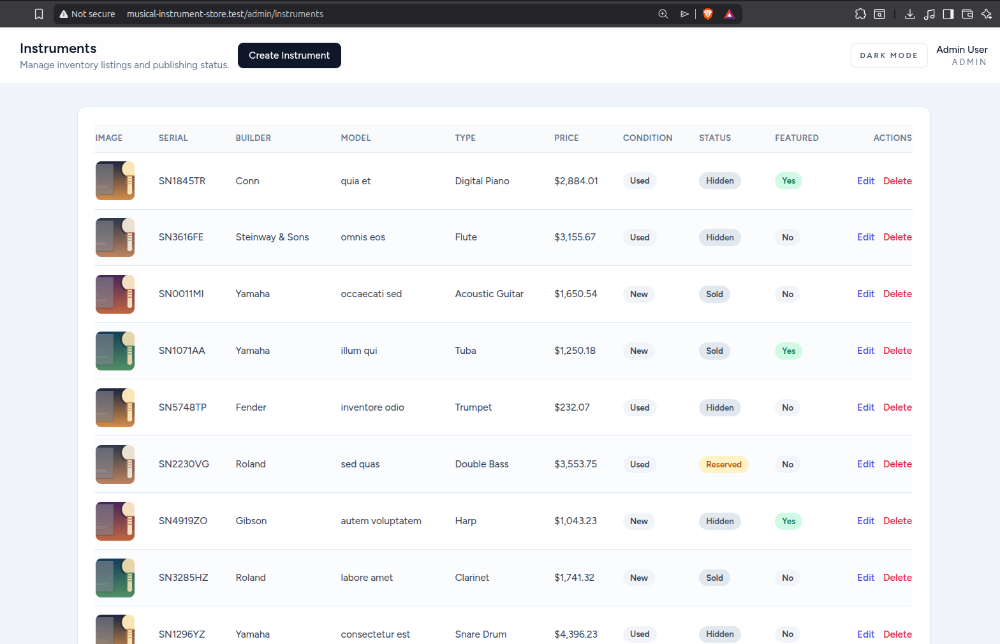
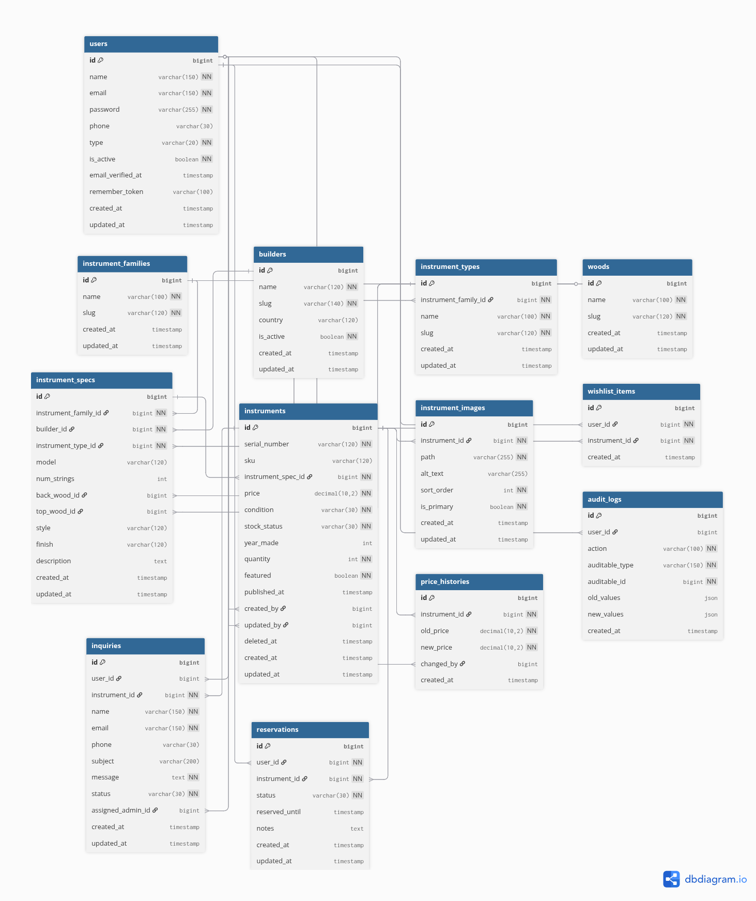

**Musical Instrument Store**
A web-based musical instrument store inspired by Rick's app from *Head First OOAD*, built to demonstrate extensible inventory modeling and specification-based search in Laravel.

**Why**
This project exists to translate an OOAD case study into a modern Laravel codebase with real-world workflows like admin catalog management, storefront search, and customer inquiries.

**Proof Of Concept**
This is a proof of concept focused on modeling the separation between descriptive instrument specifications and sellable inventory items, then wiring that model into a functional storefront and admin workflow.

**Core Idea**
- `instrument_specs` stores searchable, descriptive attributes (builder, type, woods, model, style, finish).
- `instruments` stores store-specific inventory data (serial number, price, stock state, publish state).

**Features**
- Storefront home and inventory browsing with featured instruments.
- Specification-based search and filters (family, type, builder, woods, condition, stock, price, free-text).
- Instrument detail pages with image gallery support via Spatie Media Library.
- Customer wishlist, inquiries, and reservation requests.
- Admin dashboard with inventory metrics, audit logs, and recent price changes.
- Admin CRUD for instrument families, types, builders, woods, and instruments.
- Automatic audit logs and price history tracking via model observers.
- Seed data for catalogs, inventory, and demo accounts.
- Feature tests covering admin and storefront workflows.

**User Roles**
- Admin: manage catalog data, inventory, inquiries, reservations, and review audit logs.
- Customer: browse inventory, manage wishlist, submit inquiries, and request reservations.

**Tech Stack**
- PHP 8.2+, Laravel 12
- Blade, Tailwind CSS, Alpine.js
- MySQL or PostgreSQL
- Laravel Breeze (auth scaffolding)
- Spatie Laravel Media Library
- Vite

**Screenshots**
Screenshots live in `docs/screenshots/`.











**Database Design**
See `docs/database.md` for table notes and the spec vs inventory split.

ERD image:



DBDiagram source:

```text
https://dbdiagram.io/d/69b66bac78c6c4bc7ae68db6
```

**Project Structure**
- `app/Http/Controllers/Admin` - admin workflows (dashboard, catalog, instruments, inquiries, reservations).
- `app/Http/Controllers/Storefront` - storefront browsing, wishlist, inquiries, reservations.
- `app/Models` - domain models and scopes (inventory, specs, inquiry/reservation status, audit logs).
- `database/migrations` - schema for inventory, specs, and supporting tables.
- `database/seeders` - demo data for catalogs, instruments, and audit/price history.
- `resources/views` - Blade templates for storefront and admin UI.
- `tests/Feature` - feature tests for admin and storefront flows.

**Setup**
1. Clone the repository and `cd` into the project.
2. Install PHP dependencies: `composer install`.
3. Create env file: `cp .env.example .env`.
4. Generate app key: `php artisan key:generate`.
5. Configure your database in `.env`.
6. Run migrations and seeders: `php artisan migrate --seed`.
7. Install frontend dependencies: `npm install`.
8. Build assets (or run dev server): `npm run build` or `npm run dev`.
9. Start the Laravel server: `php artisan serve`.

**Environment Notes**
- Seeded instrument images are generated locally during seeding and attached via Spatie Media Library.
- If images are not visible in the browser, run `php artisan storage:link`.

**Seeded Demo Accounts**
- Admin: `admin@example.com` / `password`
- Customer: `customer@example.com` / `password`

**Running Tests**
- `php artisan test`

**Branch Strategy**
See `docs/branch-strategy.md` for the workflow and naming conventions.